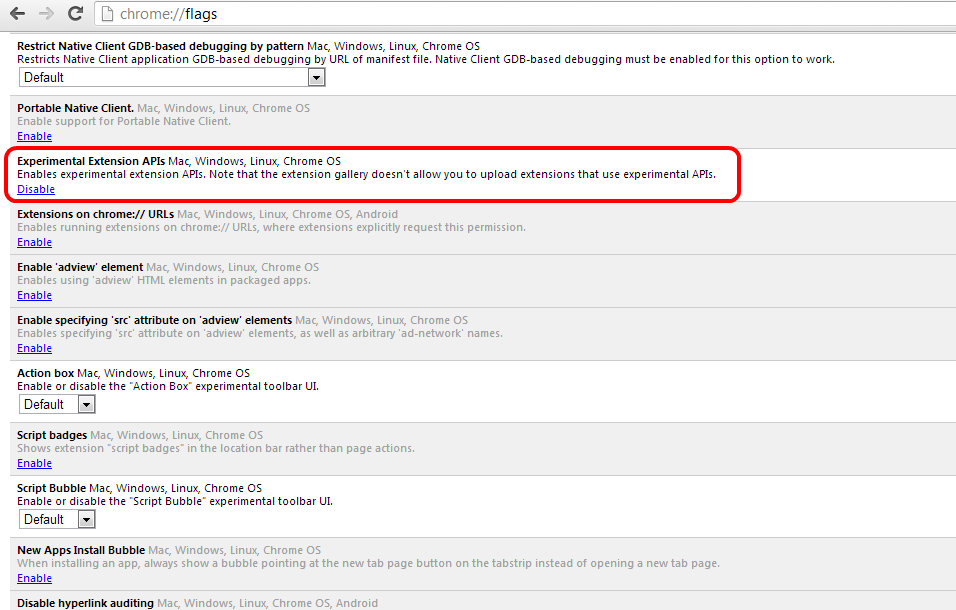
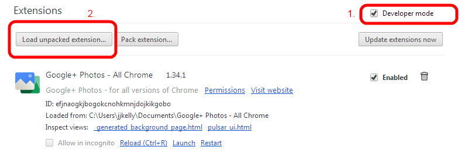
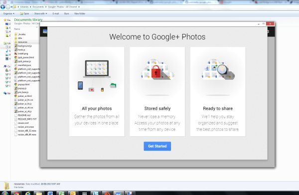

Google+ Photos - All Chrome
==================

Google+ Photos extension for Chrome that works on all versions - not just Pixels

### About

* The original extensions javascript has been unminified and adjusted so that it not starts on a non Chromebook Pixel

### Install

* Download this git repository
* In Chrome open `chrome://flags` and Enable 'Experimental Extensions APIs'
 * refer screenshot below

* In Chrome Manage Extensions page enable 'Developer mode'
  * refer 1. in screenshot below
* Then click 'Load unpacked extension' and choose the folder for this git repo

### Use

Once installed you can now launch Google+ Photos from your Chrome apps menu, refer below screenshot of startup in Win 7

